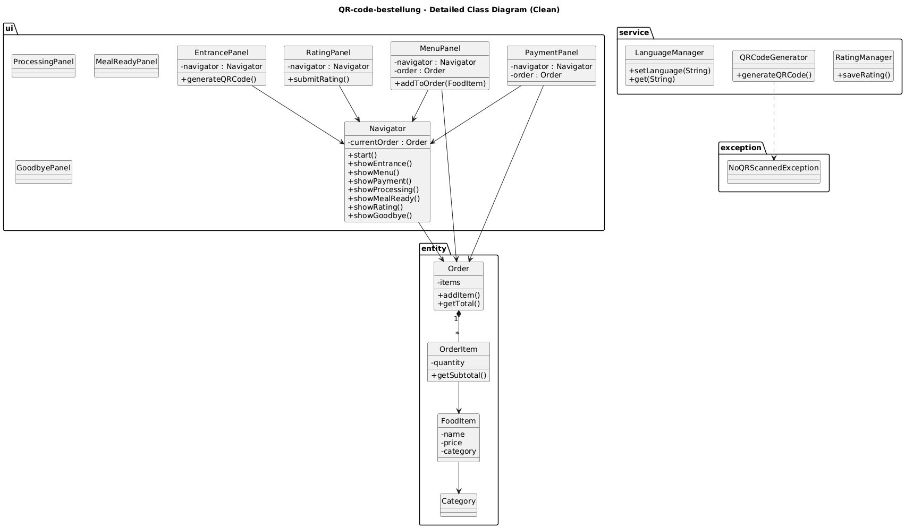

# QR-Code-Bestellsystem (Desktop-Version)

## Projektbeschreibung
Dieses Projekt ist ein desktop-basiertes Restaurant-Bestellsimulationssystem.  
Es zeigt, wie Kunden durch Scannen eines QR-Codes Bestellungen aufgeben können, ohne mit dem Personal zu interagieren.  
Das System dient hauptsächlich zu Lern- und Demonstrationszwecken.

---

## Bestellablauf
1. QR-Code scannen, um ins System zu gelangen
2. Speisen aus der Karte auswählen
3. Bestellung bestätigen
4. Zahlungsmethode wählen
5. Auf die Zubereitung warten
6. Benachrichtigung "Gericht bereit" erhalten
7. Bewertung abgeben
8. Sitzung beenden

---

## Hauptfunktionen
- QR-Code-Eintrittssimulation
- Menü durchsuchen
- Bestellung erstellen
- Zahlungsmethode auswählen
- Bestellverarbeitung simulieren
- Bewertung abgeben
- Mehrsprachige Unterstützung (Englisch / Deutsch / Chinesisch)

---

## Verwendete Technologien
- Java
- Swing
- Maven
- ZXing (QR-Code-Generierung)
- JUnit (Tests)

---

## Projektstruktur
Das Projekt folgt einer geschichteten Architektur:
- **UI-Ebene**: EntrancePanel, MenuPanel, PaymentPanel, ProcessingPanel, MealReadyPanel, RatingPanel, GoodbyePanel, Navigator
- **Entitätsebene**: Order, OrderItem, FoodItem, Category
- **Service-Ebene**: QRCodeGenerator, LanguageManager, RatingManager
- **Exception**: NoQRScannedException

---

## UML-Klassendiagramm
  
*(Das Diagramm zeigt die Kernklassen und ihre Beziehungen.)*

---

## Ausführungshinweise
1. Stellen Sie sicher, dass **Java 11+** und **Maven** installiert sind.
2. Klonen Sie das Repository und navigieren Sie zum Projektverzeichnis.
3. Bauen Sie das Projekt: mvn clean compile
4. Führen Sie die Anwendung aus:mvn exec:java -Dexec.mainClass="com.restaurant.desktop.MainApp"

Oder öffnen Sie das Projekt in IntelliJ IDEA und starten Sie `MainApp.java`.

---

## Verwendete SE2-Konzepte
- **Objekte und Klassen**: Alle Entität- und UI-Klassen.
- **Collections und Generics**: `List<FoodItem>`, `Map<Category, List<FoodItem>>`, `ButtonGroup`.
- **Exceptions**: Eigene `NoQRScannedException`, try-catch für QR-Generierung und Eingabevalidierung.
- **GUI (Swing)**: Vollständige Oberfläche mit mehreren Panels und Navigation.
- **Streams**: Wird in `Order.getTotalAmount()` zur Berechnung der Gesamtsumme verwendet.
- **Datei-I/O**: Bewertungen werden über `RatingManager` in `ratings.txt` gespeichert.
- **Enums**: `Category`-Enum mit mehrsprachigen Anzeigenamen.
- **ResourceBundle**: `LanguageManager` für i18n-Unterstützung (Chinesisch, Englisch, Deutsch).
- **Threads**: `SwingUtilities.invokeLater` gewährleistet Thread-Sicherheit; `SwingWorker` in `ProcessingPanel` simuliert das Kochen (optional).
- **Logging**: Einfache `System.out`-Ausgaben; könnte mit `java.util.logging` verbessert werden.
- **Testing**: JUnit-Tests für die `Order`-Klasse (siehe `src/test/java`).

---

## Aufgabenverteilung
Siehe `Bewertungsbogen.xlsx` für die detaillierte Aufgabenverteilung im Team.

---

## Lernnotizen (Nachdenkzettel)
Persönliche Lernnotizen befinden sich im Verzeichnis `nachdenkzettel/`.

---

## KI-Nutzung 
Im Rahmen dieses Projekts wurden generative KI-Tools für folgende unterstützende Aufgaben eingesetzt:
- Übersetzung von Code-Kommentaren und Dokumentation ins Deutsche
- Vorschläge zur Fehlerbehebung während der Entwicklung

Alle generierten Inhalte wurden von uns geprüft, angepasst und in den Projektkontext integriert. Der finale Code und die fachliche Umsetzung sind unsere eigene Arbeit.

---

## Hinweis
Dieses Projekt wird ausschließlich für akademische Zwecke entwickelt.

